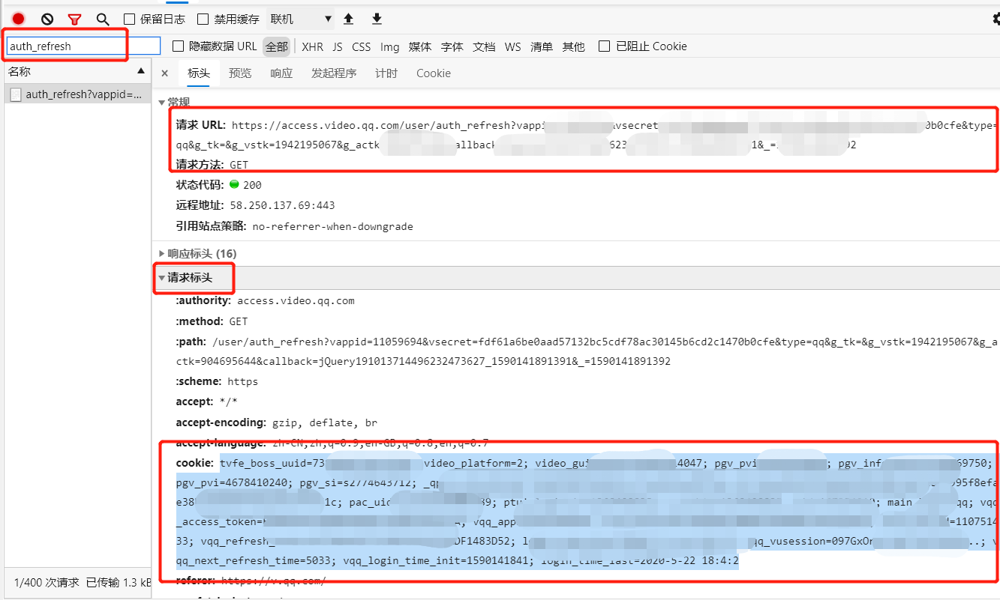
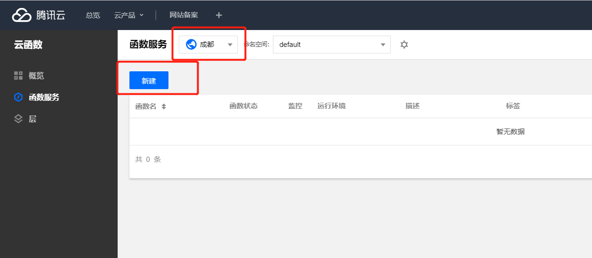
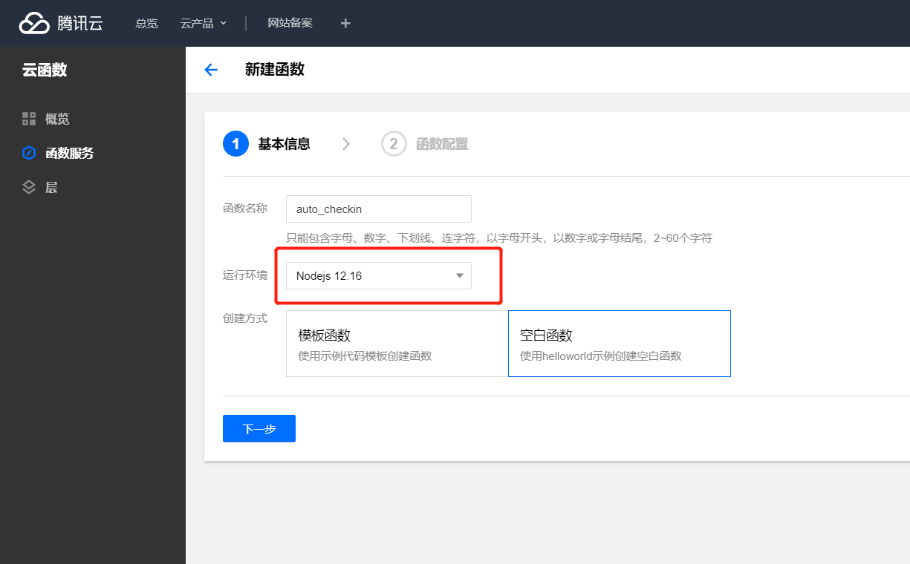
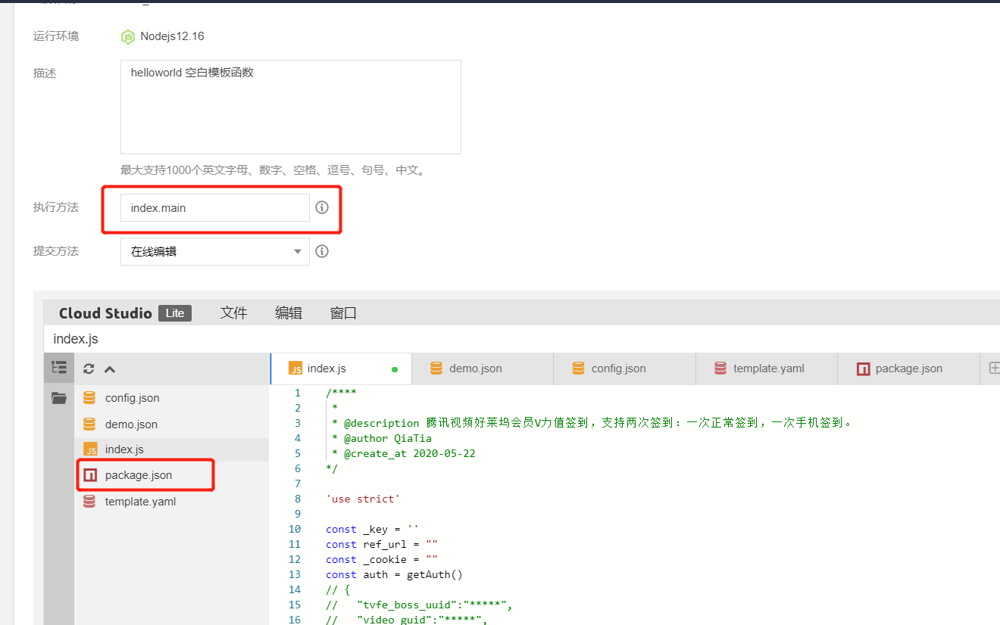
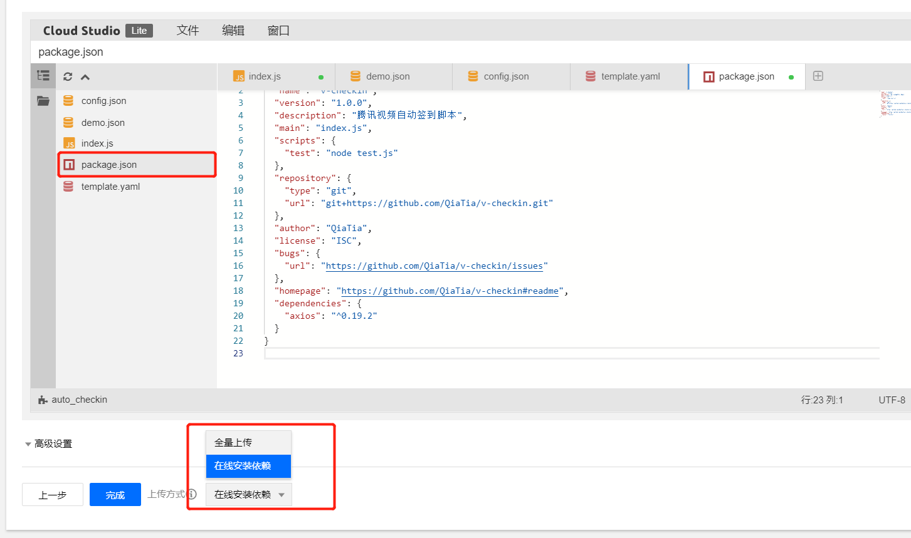
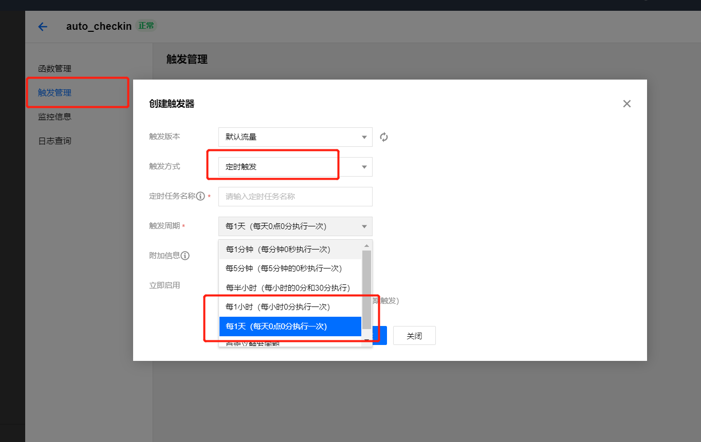

# v-checkin

🚀 腾讯视频好莱坞会员V力值签到，支持两次签到：一次正常签到，一次手机签到。

## 准备

```shell
git clone https://github.com/QiaTia/v-checkin.git && cd v-checkin && npm install
```

* 注册[Server酱](http://sc.ftqq.com/)，获取`SCKEY`，修改脚本`index.js`中的`_key`
> 用来通知微信提醒签到获得了多少V力值和**Cookie失效**，如果你不打算通知或者有其他方式，可以跳过

* 需要一台安装有`NodeJS`环境的`Linux`服务器或者使用[腾讯云Serverless](https://console.cloud.tencent.com/scf)
> 用来定时执行脚本

* 获取Cookie

1. 电脑打开浏览器访问`v.qq.com`，打开控制台(`F12`)、切换到Network，找到`https://access.video.qq.com/user/auth_refresh`的接口，把`Request URL:`后的地址都复制一下，填写到脚本的`ref_url`中，如：



```javascript
const ref_url = 'https://access.video.qq.com/user/auth_refresh?vappid=11059694&vsecret=********&type=qq&g_tk=&g_vstk=********&g_actk=********&callback=jQuery191048649********_1575435********4&_=1575435********'
```

> 可以搜索`auth_refresh`进行过滤

2. 还是`auth_refresh`这个接口，复制`Request Header`中的`cookie`，填写到脚本的`login_headers`的`_cookie`中


```javascript
const _cookie ='tvfe_boss_uuid=********; pgv_pvid=********; video_guid=***********; video_platform=2; pgv_info=ssid=***********; pgv_pvi=*************; pgv_si=*************; _qpsvr_localtk=***************; ptisp=; ptui_loginuin=************; RK=*************; ptcz=***************; main_login=qq; vqq_access_token=****************; vqq_appid=101483052; vqq_openid=********************; vqq_vuserid=*********************; vqq_vusession=dzsfo; vqq_refresh_token=*****************; uid=**************;'
```

## 定时执行

### Linux服务器

使用`crontab`定时执行就可以了，以下表达式为每天凌晨1点执行一次

```shell
0 1 * * * node ./index.js
```

### 腾讯云Serverless

使用腾讯云云函数来执行，方便没有服务器的同学。首先需要创建函数服务，打开腾讯云[云函数 - 控制台](https://console.cloud.tencent.com/scf)

#### 编写函数

1. 单击左侧导航栏【函数服务】，进入“函数服务”页面。
2. 在页面上方选择一个地域，最好选择离你常用地区近点的，不至于导致账号异常。单击【新建】。如下图所示：



3. 在“新建函数”页面填写函数基础信息，单击【下一步】。如下图所示：



* 函数名称：自定义填写
* 运行环境：选择 NodeJs 12.16”。
* 创建方式：选择 “空白函数”。

4. 填写描述，复制刚才修改好的脚本`index.js`内容到下面的代码框中。如下图所示：



* 执行方法需要修改为index.main

5. 创建`package.json`文件, 复制本目录的`package.json`的内容粘贴进去, 上传方式选择在线安装依赖, 然后点击完成



函数创建完成后，自动进入创建成功函数的“函数配置”页面，可查看该云函数的函数配置信息。

如果填错了代码，可以在选择【函数代码】中修改，修改完成后记得点击保存；点击【测试】，运行代码，测试结果是成功的话就没有问题了。

#### 设置触发方式

1. 在已创建函数的详情页面，选择【触发方式】，并单击【添加触发方式】。如下图所示：



* 触发方式：选择 "定时触发"。
* 触发周期：选择 "每一天"

2. 填写完成点击【保存】即可。

## 特别感谢

[python版](https://github.com/sy-records/v-checkin/)

## License

ISC